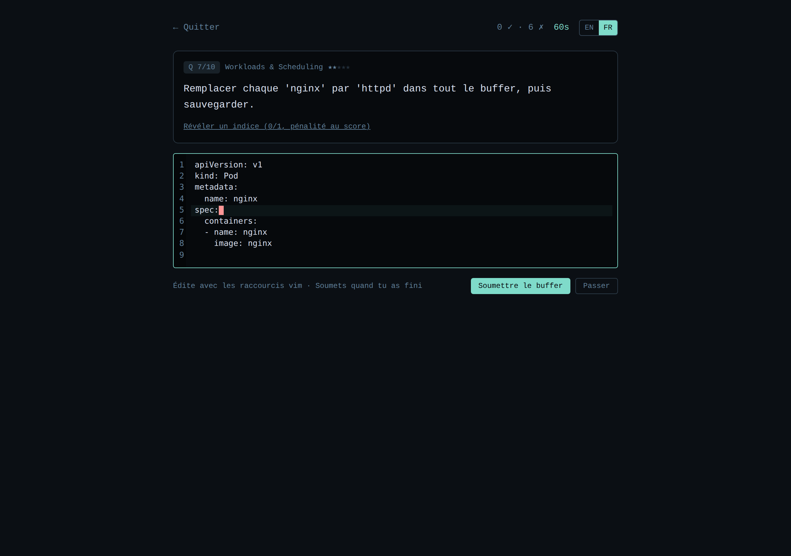

# CKA-Sim

> 🇫🇷 Version française · [🇬🇧 English](./README.md)

> Simulateur de **dextérité kubectl/shell/vi** pour préparer la certification
> [Certified Kubernetes Administrator (CKA)](https://www.cncf.io/certification/cka/).

Pas de cluster à monter, pas d'examen blanc à 50 €. Juste : un scénario, une
commande, un chrono. L'objectif est d'entraîner les **réflexes de frappe** qui
font la différence entre réussir le CKA dans le temps imparti et tomber court.

---

## 📸 Aperçu

| Accueil | Session — question |
| :---: | :---: |
|  |  |
| **Feedback après une bonne réponse** | **Score de fin de session** |
|  |  |

**Dashboard personnel** — courbe de score, heatmap domaine × difficulté, streak, top des questions ratées :


**Paramètres** — choisis le provider IA (API Anthropic ou OpenRouter), le backend d'embeddings (bge-small local ou OpenRouter), bascule entre mode examen et RAG. Les clés restent sur ta machine :


**Éditeur vi** — les questions de catégorie vi affichent un vrai éditeur CodeMirror en mode vim avec numéros de ligne, modes normal/insert, et un compteur de frappes qui score ton efficacité vs. une solution optimale après soumission :



**Sources de connaissance custom** — colle une URL publique dans Paramètres → Sources de connaissance et le crawler fetche, extrait, chunke et embedde la page à la volée. Le RAG du tuteur fusionne ces sources avec la doc Kubernetes embarquée :

La capture des paramètres ci-dessus inclut le panneau Sources avec trois entrées de démo (dont une en erreur pour montrer comment les échecs sont surfacés).

---

## 🎯 Pourquoi ce projet

Le CKA, c'est 2 h pour ~15-20 tâches sur cluster réel. Beaucoup d'échecs ne
viennent pas d'un manque de connaissance Kubernetes mais d'un manque de
vitesse :

- mauvais usage des alias (`k` au lieu de `kubectl`)
- `--dry-run=client -o yaml` pas mémorisé
- contexte/namespace pas fixé une bonne fois pour toutes
- JSONPath improvisé dans la panique
- édition vi maladroite qui mange les minutes

Les plateformes existantes (Killer.sh, KodeKloud) testent surtout la
**résolution de problème**. Cet outil cible la **dextérité pure**, le réflexe
moteur qui s'acquiert par la répétition courte et chronométrée.

---

## ✨ Ce que fait l'outil aujourd'hui

La roadmap originale en 6 sprints est livrée.

**Base de questions (48 questions seed, 3 catégories)**
- 20 questions kubectl couvrant les 5 domaines officiels du CKA
- 20 questions shell (grep / awk / sed / jq / yq / systemctl /
  journalctl / find / ss / curl / openssl / tar / base64 / ps / lsof / dig)
- 8 questions vi avec un vrai éditeur CodeMirror + vim et un scoring
  d'efficacité de frappe (ratio `optimal / réel`)

**Moteur**
- Chrono de 60 s par question, score en fin de session
- Validation **déterministe** : regex pour les commandes, comparaison
  de buffer pour vi (normalisation CRLF, multi-cibles, tolérance
  trailing newline)
- Système d'indices avec pénalité au score
- Mode examen (chrono pur, comme le vrai CKA — désactive l'IA)

**Tuteur IA (BYOK)**
- Explications streamées après chaque réponse (Server-Sent Events)
- Deux providers derrière une seule interface : **API Anthropic**
  (`x-api-key`) et **OpenRouter** (n'importe quel modèle de chat supporté)
- System prompt verrouillé : réponses courtes, exam-focused, dans la
  langue de l'utilisateur

**RAG ancré sur la doc**
- `kb.db` embarqué, généré depuis `kb/*.md` aligné sur les questions
- Sources custom : tu colles une URL publique, le crawler fetche /
  extrait / chunk / embedde la page à la volée dans un `kb-user.db`
  writable
- La retrieval fusionne les deux index par distance et affiche des
  citations cliquables sous le streaming
- Providers d'embedding : `bge-small-en` local (in-process, sans clé)
  ou OpenRouter (`text-embedding-3-small/large`, `qwen3-embedding-0.6b`)

**Persistance + dashboard**
- Historique SQLite des runs et attempts, indexé par cookie uid anonyme
- Dashboard avec courbe de score, heatmap domaine × difficulté, streak
  quotidien, top 10 des questions ratées
- Export JSON de tout l'historique (`/api/me/export`)

**Bilingue**
- UI complète EN/FR via next-intl, URLs locale-préfixées, switcher de
  langue
- Énoncés, indices et explications des questions traduits

**Qualité**
- Suite de 51 tests [vitest](https://vitest.dev) couvrant validators,
  engine, loader, settings repo, crawler, sources repo
- 100 % local-first : rien ne sort de la machine sans un appel BYOK
  explicite à un provider que tu as choisi

---

## 🚀 Démarrage rapide

Prérequis : **Node.js ≥ 22**.

```bash
git clone https://github.com/ictdevops/cka-sim.git
cd cka-sim
npm install
npm run dev
```

Ouvre <http://localhost:3000>. Tape `Entrée` pour valider chaque commande.

### Optionnel : activer le RAG ancré sur la doc

Le tuteur IA peut ancrer ses réponses sur les extraits de documentation
Kubernetes embarqués. Pour construire l'index vectoriel local (setup
unique, ~130 Mo de modèle téléchargé depuis Hugging Face) :

```bash
npm run kb:build
```

Cela génère `kb.db` à la racine du repo. Redémarre le serveur et le
tuteur citera désormais les URLs sources dans ses réponses (avec RAG
activé dans les paramètres). Sans cette étape, le tuteur fonctionne
quand même mais répond de mémoire.

### Scripts disponibles

| Script              | Description                              |
| ------------------- | ---------------------------------------- |
| `npm run dev`       | Serveur de dev avec HMR                  |
| `npm run build`     | Build de production                      |
| `npm start`         | Démarre le build de production           |
| `npm run typecheck` | Vérifie les types TypeScript             |
| `npm run lint`      | Linter Next.js                           |
| `npm run kb:build`  | Génère l'index vectoriel RAG (`kb.db`)   |
| `npm test`          | Lance la suite vitest (51 tests)         |

---

## 🧱 Architecture (vue rapide)

```
src/
├── app/                    Pages Next.js (App Router)
│   ├── page.tsx            Accueil
│   ├── about/page.tsx      Roadmap
│   └── session/page.tsx    Session active
├── components/             UI (Prompt, Timer, QuestionCard, ...)
├── lib/
│   ├── questions/          Types + chargement des questions
│   ├── validators/         Validation déterministe (regex)
│   └── session/            Moteur de session pur (state machine)
└── data/
    └── questions/
        └── kubectl.json    Base de questions seed
```

Le **moteur de session** (`lib/session/engine.ts`) est volontairement *pur* :
des fonctions `(state, event) => state` sans I/O, faciles à tester et à
brancher sur un store quand on en aura besoin.

Le **validateur** est une interface (`lib/validators/types.ts`) avec une
implémentation regex au MVP (`RegexValidator`). On pourra ajouter un
`SemanticValidator` (parsing AST) ou un `ExecutionValidator` (cluster `kind`)
sans toucher au reste.

📖 Détails dans [docs/ARCHITECTURE.md](./docs/ARCHITECTURE.md).

---

## 📝 Ajouter ou éditer des questions

Les questions sont dans `src/data/questions/kubectl.json`. Chaque question est
auto-décrivante :

```jsonc
{
  "id": "k-pods-001",
  "category": "kubectl",
  "domain": "workloads-scheduling",
  "scenario": "Lister tous les pods du namespace 'web'.",
  "difficulty": 1,
  "challenge": {
    "type": "command",
    "expected": "kubectl get pods -n web",
    "acceptedPatterns": [
      "^(kubectl|k)\\s+get\\s+(pods?|po)\\s+(-n\\s+web|--namespace[= ]web)$"
    ],
    "explanation": "..."
  }
}
```

📖 Schéma complet et conventions :
[docs/QUESTION_SCHEMA.md](./docs/QUESTION_SCHEMA.md).

---

## 🗺 Roadmap

La roadmap originale en 6 sprints est livrée. Les itérations futures
sont listées dans la section « Backlog » plus bas.

| Sprint | Objectif                                                          | Statut  |
| -----: | ----------------------------------------------------------------- | ------- |
|      1 | Dextérité kubectl pure (validation regex, chrono)                 | ✅ Fait |
|    1.5 | Bilingue EN/FR via `next-intl` (URLs locale-préfixées)            | ✅ Fait |
|      2 | Persistance : runs/attempts SQLite + dashboard perso              | ✅ Fait |
|      3 | Tuteur IA (streaming OpenRouter, feedback post-réponse)           | ✅ Fait |
|    3.1 | Provider API Anthropic (`x-api-key`) porté depuis dash-pass       | ✅ Fait |
|      4 | RAG ancré sur la doc (`sqlite-vec` + embeddings local/OpenRouter) | ✅ Fait |
|      5 | Extensions shell + vi (CodeMirror vim, keystroke-efficiency)      | ✅ Fait |
|      6 | Sources web custom + crawler + suite de 51 tests vitest           | ✅ Fait |

### Backlog (post-roadmap, à prioriser selon les retours)

- **Mode lab** — exécution réelle des commandes contre un cluster
  `kind` éphémère pour validation end-to-end
- **Multi-utilisateur + leaderboard** (Niveau 2) — magic-link / GitHub
  OAuth, leaderboards par catégorie et par domaine, re-validation
  anti-cheat
- **`robots.txt` + rate limiting per-host** dans le crawler quand le
  nombre de sources grandit
- **Auto-refresh `node-cron`** des sources utilisateur
- **Filtres de session par catégorie** dans l'UI (le moteur et le
  loader acceptent déjà un `QuestionFilter` ; il manque juste le picker)
- **Comptage de keystrokes vim mode-aware** (le compteur actuel est un
  proxy keydown — précis pour le ratio mais pas parfait)
- **Génération de questions assistée par IA** validée en CI sur cluster
  `kind` (auto-PRs)
- **Autres certifications** — même moteur pour CKAD, CKS, Linux, Git,
  Terraform, AWS CLI

📖 Détails par sprint : [docs/ROADMAP.md](./docs/ROADMAP.md).

---

## 💾 Où vivent tes données

- Base SQLite locale à `./data/app.db` (override via `CKA_SIM_DATA_DIR`).
- Un identifiant anonyme est stocké dans le cookie `cka-sim-uid`. Effacer
  les cookies = repartir de zéro.
- Pour Docker, monte `/app/data` en volume pour conserver tes runs lors
  des upgrades du container.
- Backup ponctuel : `curl -b 'cka-sim-uid=...' http://localhost:3000/api/me/export > backup.json`.

---

## 🔐 Vie privée & licences

- **Aucun tracking, aucune télémétrie**, aucune donnée envoyée à un tiers au
  Sprint 1.
- Les futurs appels IA seront **opt-in**, BYOK (clé OpenRouter) ou via OAuth
  Claude — toujours côté utilisateur.
- Les futures sources documentaires (kubernetes.io, etc.) sont
  redistribuables sous leur licence d'origine (kubernetes.io = CC BY 4.0).
  Toute citation IA renverra à l'URL source pour traçabilité.

---

## 🤝 Contribuer

PRs bienvenues, en particulier sur :

- l'ajout de questions (relire
  [docs/QUESTION_SCHEMA.md](./docs/QUESTION_SCHEMA.md))
- le rapport de patterns acceptés manquants pour des commandes valides
  rejetées à tort (ouvre une issue avec la commande rejetée)

---

## 📜 Licence

À définir (probablement MIT ou Apache 2.0).
