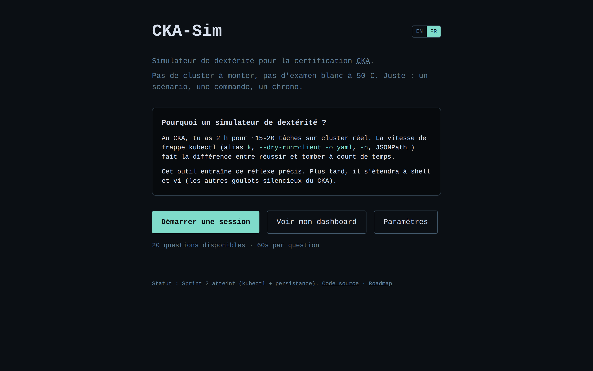
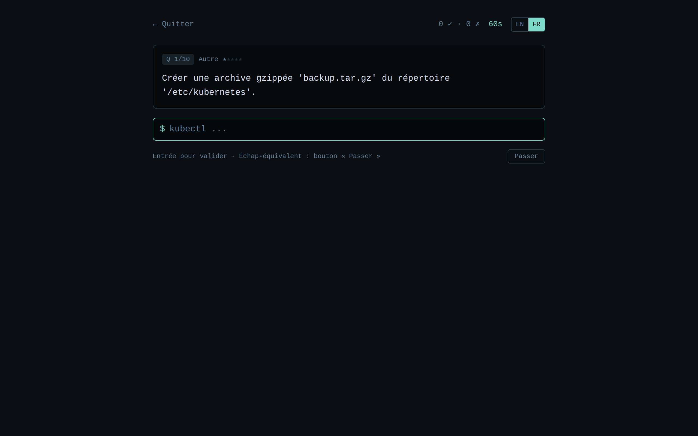
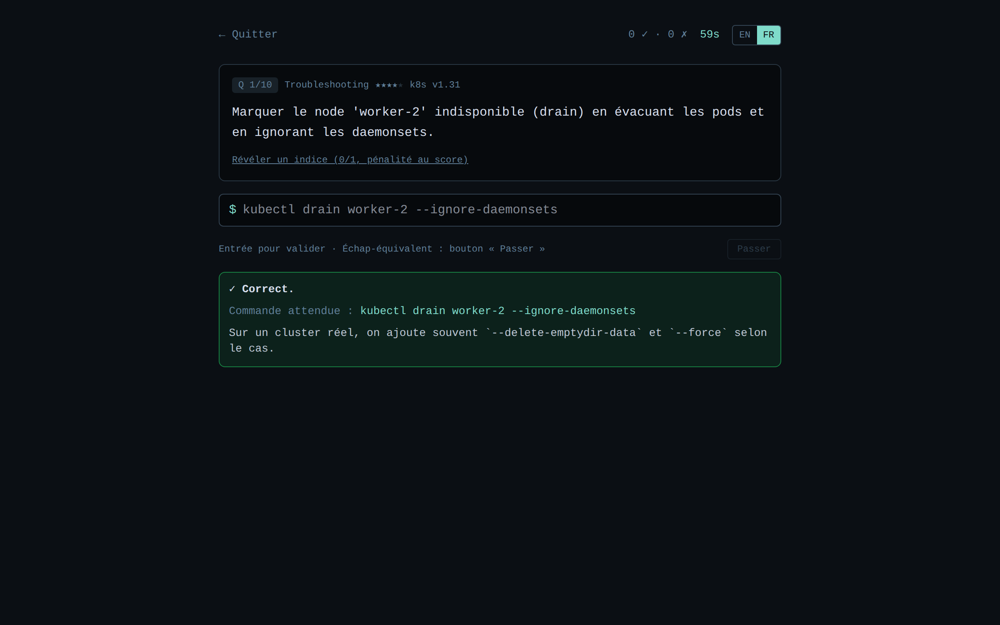
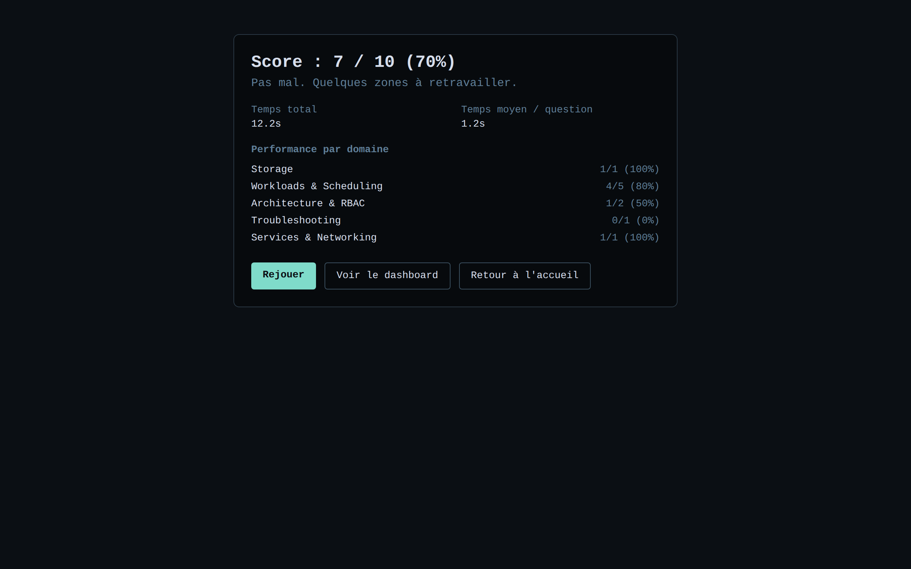
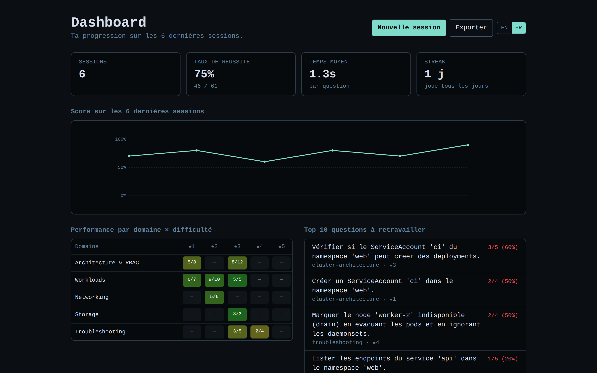
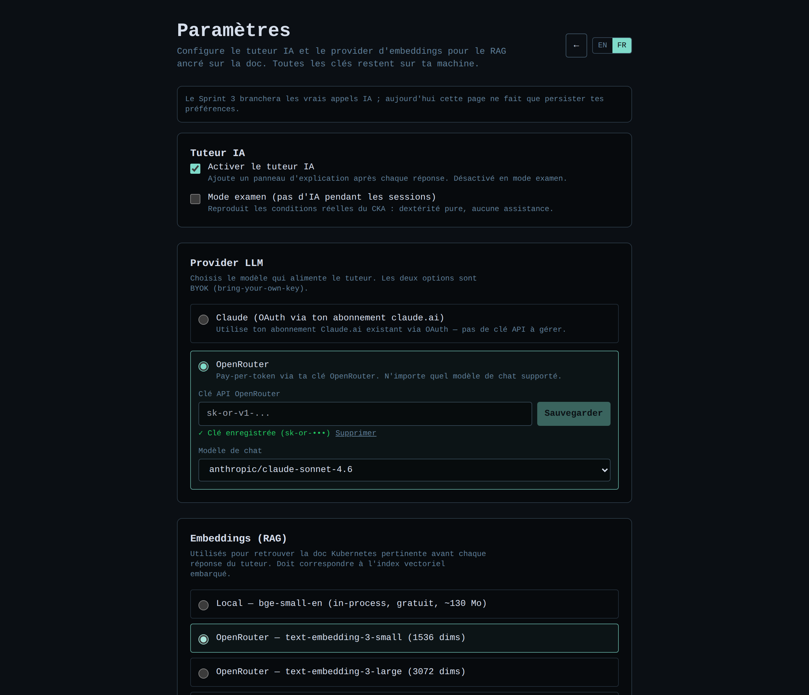

# CKA-Sim

> 🇫🇷 Version française · [🇬🇧 English](./README.md)

> Simulateur de **dextérité kubectl/shell/vi** pour préparer la certification
> [Certified Kubernetes Administrator (CKA)](https://www.cncf.io/certification/cka/).

Pas de cluster à monter, pas d'examen blanc à 50 €. Juste : un scénario, une
commande, un chrono. L'objectif est d'entraîner les **réflexes de frappe** qui
font la différence entre réussir le CKA dans le temps imparti et tomber court.

---

## 📸 Aperçu

| Accueil | Session — question |
| :---: | :---: |
|  |  |
| **Feedback après une bonne réponse** | **Score de fin de session** |
|  |  |

**Dashboard personnel** — courbe de score, heatmap domaine × difficulté, streak, top des questions ratées :



**Paramètres** — choisis le provider IA (Claude OAuth ou OpenRouter), le backend d'embeddings (bge-small local ou OpenRouter), bascule entre mode examen et RAG. Les clés restent sur ta machine :



---

## 🎯 Pourquoi ce projet

Le CKA, c'est 2 h pour ~15-20 tâches sur cluster réel. Beaucoup d'échecs ne
viennent pas d'un manque de connaissance Kubernetes mais d'un manque de
vitesse :

- mauvais usage des alias (`k` au lieu de `kubectl`)
- `--dry-run=client -o yaml` pas mémorisé
- contexte/namespace pas fixé une bonne fois pour toutes
- JSONPath improvisé dans la panique
- édition vi maladroite qui mange les minutes

Les plateformes existantes (Killer.sh, KodeKloud) testent surtout la
**résolution de problème**. Cet outil cible la **dextérité pure**, le réflexe
moteur qui s'acquiert par la répétition courte et chronométrée.

---

## ✨ Ce que fait l'outil aujourd'hui (jusqu'au Sprint 2)

- 20 questions kubectl couvrant les 5 domaines officiels du CKA
- Chrono de 60 s par question, score en fin de session
- Validation **déterministe** par regex (gère les variantes courantes :
  `-n`/`--namespace`, position des flags, alias `k`/`kubectl`, etc.)
- Indices révélables avec pénalité
- Récapitulatif par domaine pour identifier les points faibles
- **Historique persistant** avec dashboard personnel : courbe de score,
  heatmap par domaine × difficulté, streak quotidien, top 10 des questions
  les plus ratées
- **Export JSON** de tout ton historique (`/api/me/export`)
- 100 % local-first : base SQLite sur disque, utilisateur local anonyme via
  cookie, pas d'auth, aucun service distant

> 🚧 Pas encore : tuteur IA, RAG, shell/vi, leaderboard.
> Voir [ROADMAP](./docs/ROADMAP.md).

---

## 🚀 Démarrage rapide

Prérequis : **Node.js ≥ 22**.

```bash
git clone https://github.com/ictdevops/cka-sim.git
cd cka-sim
npm install
npm run dev
```

Ouvre <http://localhost:3000>. Tape `Entrée` pour valider chaque commande.

### Scripts disponibles

| Script              | Description                              |
| ------------------- | ---------------------------------------- |
| `npm run dev`       | Serveur de dev avec HMR                  |
| `npm run build`     | Build de production                      |
| `npm start`         | Démarre le build de production           |
| `npm run typecheck` | Vérifie les types TypeScript             |
| `npm run lint`      | Linter Next.js                           |

---

## 🧱 Architecture (vue rapide)

```
src/
├── app/                    Pages Next.js (App Router)
│   ├── page.tsx            Accueil
│   ├── about/page.tsx      Roadmap
│   └── session/page.tsx    Session active
├── components/             UI (Prompt, Timer, QuestionCard, ...)
├── lib/
│   ├── questions/          Types + chargement des questions
│   ├── validators/         Validation déterministe (regex)
│   └── session/            Moteur de session pur (state machine)
└── data/
    └── questions/
        └── kubectl.json    Base de questions seed
```

Le **moteur de session** (`lib/session/engine.ts`) est volontairement *pur* :
des fonctions `(state, event) => state` sans I/O, faciles à tester et à
brancher sur un store quand on en aura besoin.

Le **validateur** est une interface (`lib/validators/types.ts`) avec une
implémentation regex au MVP (`RegexValidator`). On pourra ajouter un
`SemanticValidator` (parsing AST) ou un `ExecutionValidator` (cluster `kind`)
sans toucher au reste.

📖 Détails dans [docs/ARCHITECTURE.md](./docs/ARCHITECTURE.md).

---

## 📝 Ajouter ou éditer des questions

Les questions sont dans `src/data/questions/kubectl.json`. Chaque question est
auto-décrivante :

```jsonc
{
  "id": "k-pods-001",
  "category": "kubectl",
  "domain": "workloads-scheduling",
  "scenario": "Lister tous les pods du namespace 'web'.",
  "difficulty": 1,
  "challenge": {
    "type": "command",
    "expected": "kubectl get pods -n web",
    "acceptedPatterns": [
      "^(kubectl|k)\\s+get\\s+(pods?|po)\\s+(-n\\s+web|--namespace[= ]web)$"
    ],
    "explanation": "..."
  }
}
```

📖 Schéma complet et conventions :
[docs/QUESTION_SCHEMA.md](./docs/QUESTION_SCHEMA.md).

---

## 🗺 Roadmap résumée

| Sprint | Objectif                                                       | Statut    |
| -----: | -------------------------------------------------------------- | --------- |
|      1 | Dextérité kubectl pure (validation regex, chrono)              | ✅ Fait   |
|      2 | Persistance : runs/attempts SQLite + dashboard perso           | ✅ Fait   |
|      3 | Tuteur IA (Claude OAuth + OpenRouter), feedback post-réponse   | À venir   |
|      4 | RAG ancré sur la doc K8s (sqlite-vec + embeddings)             | À venir   |
|      5 | Extensions shell + vi (codemirror-vim, scoring efficacité)     | À venir   |
|      6 | Sources web custom + UI admin d'ingestion                      | À venir   |

📖 Détails par sprint : [docs/ROADMAP.md](./docs/ROADMAP.md).

---

## 💾 Où vivent tes données

- Base SQLite locale à `./data/app.db` (override via `CKA_SIM_DATA_DIR`).
- Un identifiant anonyme est stocké dans le cookie `cka-sim-uid`. Effacer
  les cookies = repartir de zéro.
- Pour Docker, monte `/app/data` en volume pour conserver tes runs lors
  des upgrades du container.
- Backup ponctuel : `curl -b 'cka-sim-uid=...' http://localhost:3000/api/me/export > backup.json`.

---

## 🔐 Vie privée & licences

- **Aucun tracking, aucune télémétrie**, aucune donnée envoyée à un tiers au
  Sprint 1.
- Les futurs appels IA seront **opt-in**, BYOK (clé OpenRouter) ou via OAuth
  Claude — toujours côté utilisateur.
- Les futures sources documentaires (kubernetes.io, etc.) sont
  redistribuables sous leur licence d'origine (kubernetes.io = CC BY 4.0).
  Toute citation IA renverra à l'URL source pour traçabilité.

---

## 🤝 Contribuer

PRs bienvenues, en particulier sur :

- l'ajout de questions (relire
  [docs/QUESTION_SCHEMA.md](./docs/QUESTION_SCHEMA.md))
- le rapport de patterns acceptés manquants pour des commandes valides
  rejetées à tort (ouvre une issue avec la commande rejetée)

---

## 📜 Licence

À définir (probablement MIT ou Apache 2.0).
