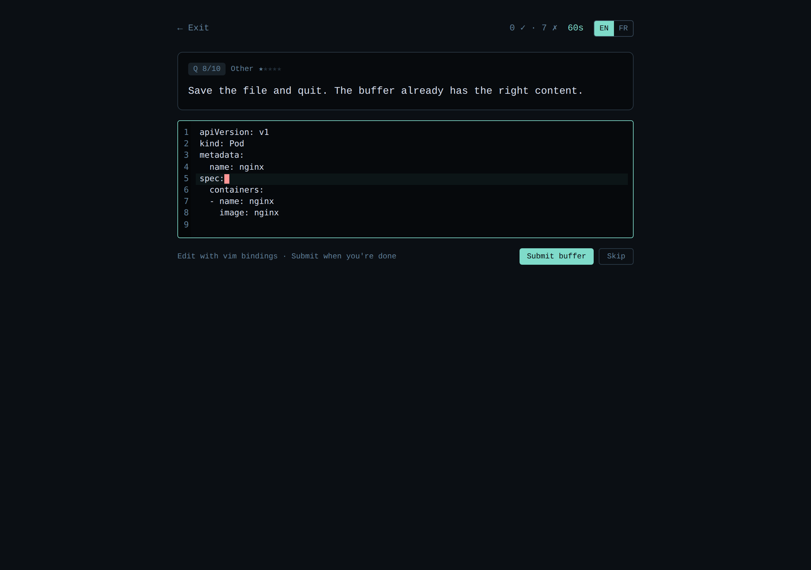

# CKA-Sim

> 🇬🇧 English version · [🇫🇷 Version française](./README.fr.md)

> A **kubectl/shell/vi dexterity simulator** to prepare for the
> [Certified Kubernetes Administrator (CKA)](https://www.cncf.io/certification/cka/)
> certification.

No cluster to spin up, no €50 mock exam. Just: a scenario, a command, a
chrono. The goal is to drill the **typing reflexes** that make the difference
between passing the CKA in time and running out of it.

---

## 📸 Preview

| Home | Session — question |
| :---: | :---: |
|  |  |
| **Feedback after a correct answer** | **End-of-session score** |
|  |  |

**Personal dashboard** — score curve, domain × difficulty heatmap, streak, top missed questions:


**Settings** — pick the AI tutor provider (Anthropic API or OpenRouter), the embedding backend (local bge-small or OpenRouter), and toggle exam mode / RAG. Keys stay on your device:


**Vi editor** — vi-category questions ship a real vim-mode CodeMirror editor with line numbers, normal/insert modes, and a keystroke counter that scores efficiency vs. an optimal solution after submit:



**Custom knowledge sources** — paste a public URL into Settings → Knowledge sources and the crawler fetches, extracts, chunks and embeds the page on the fly. The tutor's RAG retrieval merges these with the bundled Kubernetes docs:

The settings screenshot above includes the Knowledge sources panel with three demo entries (one with a deliberate error to show how failures surface).

---

## 🎯 Why this project

The CKA is 2 hours for ~15-20 tasks on a real cluster. Many failures are not
about lacking Kubernetes knowledge — they're about lacking speed:

- not using the `k` alias instead of `kubectl`
- forgetting `--dry-run=client -o yaml`
- typing `-n <ns>` on every command instead of fixing the context once
- improvising JSONPath under pressure
- clumsy vi editing eating up the minutes

Existing platforms (Killer.sh, KodeKloud) mostly drill **problem-solving**.
This tool targets **pure dexterity**, the motor reflex that comes from short,
chronometered repetition.

---

## ✨ What it does today

The original 6-sprint roadmap is complete.

**Question bank (48 seed questions, 3 categories)**
- 20 kubectl questions across the 5 official CKA domains
- 20 shell questions (grep / awk / sed / jq / yq / systemctl /
  journalctl / find / ss / curl / openssl / tar / base64 / ps / lsof / dig)
- 8 vi questions backed by a real CodeMirror + vim editor with
  keystroke-efficiency scoring (`optimal / actual` ratio)

**Engine**
- 60-second chrono per question, end-of-session score
- **Deterministic** validation: regex for command questions, buffer
  comparison for vi (CRLF normalization, multi-target acceptance,
  trailing-newline tolerance)
- Hint system with score penalty
- Exam mode (chrono-only, like the real CKA — disables AI assistance)

**AI tutor (BYOK)**
- Streaming explanations after each answer (Server-Sent Events)
- Two providers behind one interface: **Anthropic API** (`x-api-key`)
  and **OpenRouter** (any supported chat model)
- System prompt locked to short, exam-focused, locale-aware replies

**Doc-grounded RAG**
- Bundled `kb.db` built from `kb/*.md` snippets aligned with the seed
  questions
- Custom user sources: paste a public URL, the crawler fetches /
  extracts / chunks / embeds it on the fly into a writable `kb-user.db`
- Retrieval merges both indexes by distance and surfaces clickable
  citations under the streamed answer
- Embedding providers: local `bge-small-en` (in-process, no key) or
  OpenRouter (`text-embedding-3-small/large`, `qwen3-embedding-0.6b`)

**Persistence + dashboard**
- SQLite history of runs and attempts, indexed by anonymous cookie uid
- Dashboard with score curve, domain × difficulty heatmap, day streak,
  top-10 most-missed questions
- JSON export of full history (`/api/me/export`)

**Bilingual**
- Full EN/FR UI via next-intl, locale-prefixed URLs, language switcher
- Question scenarios, hints and explanations translated

**Quality**
- 51-test [vitest](https://vitest.dev) suite covering validators, engine,
  loader, settings repo, crawler, sources repo
- 100% local-first: nothing leaves the box without an explicit BYOK
  call to a provider you chose

---

## 🚀 Quick start

Requirements: **Node.js ≥ 22**.

```bash
git clone https://github.com/ictdevops/cka-sim.git
cd cka-sim
npm install
npm run dev
```

Open <http://localhost:3000>. Press `Enter` to submit each command.

### Optional: enable the doc-grounded RAG

The AI tutor can ground its answers in the bundled Kubernetes
documentation snippets. To build the local vector index (one-time
setup, ~130 MB model download from Hugging Face on first run):

```bash
npm run kb:build
```

This produces `kb.db` at the repo root. Restart the server and the
tutor will now cite source URLs in its answers when RAG is enabled in
Settings. Without this step, the tutor still works but answers from its
own knowledge.

### Available scripts

| Script              | Description                              |
| ------------------- | ---------------------------------------- |
| `npm run dev`       | Dev server with HMR                      |
| `npm run build`     | Production build                         |
| `npm start`         | Start the production build               |
| `npm run typecheck` | Run TypeScript type checking             |
| `npm run lint`      | Run Next.js linter                       |
| `npm run kb:build`  | Build the RAG vector index (`kb.db`)     |
| `npm test`          | Run the vitest suite (51 tests)          |

---

## 🧱 Architecture (overview)

```
src/
├── app/                    Next.js pages (App Router)
│   ├── page.tsx            Home
│   ├── about/page.tsx      Roadmap
│   └── session/page.tsx    Active session
├── components/             UI (Prompt, Timer, QuestionCard, ...)
├── lib/
│   ├── questions/          Types + question loading
│   ├── validators/         Deterministic validation (regex)
│   └── session/            Pure session engine (state machine)
└── data/
    └── questions/
        └── kubectl.json    Seed question bank
```

The **session engine** (`lib/session/engine.ts`) is intentionally *pure*:
`(state, event) => state` functions, no I/O, easy to test and to plug into a
store when needed.

The **validator** is an interface (`lib/validators/types.ts`) with a regex
implementation in the MVP (`RegexValidator`). A `SemanticValidator` (AST
parsing) or an `ExecutionValidator` (`kind` cluster) can be added later
without touching the rest.

📖 Details in [docs/ARCHITECTURE.md](./docs/ARCHITECTURE.md).

---

## 📝 Add or edit questions

Questions live in `src/data/questions/kubectl.json`. Each question is
self-describing:

```jsonc
{
  "id": "k-pods-001",
  "category": "kubectl",
  "domain": "workloads-scheduling",
  "scenario": "List all pods in the 'web' namespace.",
  "difficulty": 1,
  "challenge": {
    "type": "command",
    "expected": "kubectl get pods -n web",
    "acceptedPatterns": [
      "^(kubectl|k)\\s+get\\s+(pods?|po)\\s+(-n\\s+web|--namespace[= ]web)$"
    ],
    "explanation": "..."
  }
}
```

📖 Full schema and conventions:
[docs/QUESTION_SCHEMA.md](./docs/QUESTION_SCHEMA.md).

---

## 🗺 Roadmap

The original 6-sprint roadmap shipped. Future iterations live in the
"Backlog" section below.

| Sprint | Goal                                                              | Status   |
| -----: | ----------------------------------------------------------------- | -------- |
|      1 | Pure kubectl dexterity (regex validation, chrono)                 | ✅ Done  |
|    1.5 | Bilingual EN/FR via `next-intl` (locale-prefixed URLs)            | ✅ Done  |
|      2 | Persistence: SQLite runs/attempts + personal dashboard            | ✅ Done  |
|      3 | AI tutor (OpenRouter streaming, post-answer feedback)             | ✅ Done  |
|    3.1 | Anthropic API provider (`x-api-key`) ported from dash-pass        | ✅ Done  |
|      4 | Doc-grounded RAG (`sqlite-vec` + local/OpenRouter embeddings)     | ✅ Done  |
|      5 | Shell + vi extensions (CodeMirror vim, keystroke-efficiency)      | ✅ Done  |
|      6 | Custom web sources + crawler + 51-test vitest suite               | ✅ Done  |

### Backlog (post-roadmap ideas, prioritised by feedback)

- **Lab mode** — execute commands against an ephemeral `kind` cluster
  for true end-to-end validation
- **Multi-user + leaderboard** (Niveau 2) — magic-link / GitHub OAuth,
  per-category and per-domain leaderboards, anti-cheat re-validation
- **`robots.txt` + per-host rate limiting** in the crawler when source
  counts grow
- **`node-cron` auto-refresh** for user sources
- **Per-category session filters** in the UI (the engine and loader
  already accept a `QuestionFilter`; only the picker is missing)
- **Vim mode-aware keystroke counting** (current count is a keydown
  proxy — accurate enough for the ratio but not perfect)
- **AI-assisted question generation** validated in CI on a `kind`
  cluster (auto-PRs)
- **Other certifications** — same engine for CKAD, CKS, Linux, Git,
  Terraform, AWS CLI

📖 Per-sprint details: [docs/ROADMAP.md](./docs/ROADMAP.md).

---

## 💾 Where your data lives

- Local SQLite database at `./data/app.db` (override with
  `CKA_SIM_DATA_DIR`).
- An anonymous user id is stored in the `cka-sim-uid` cookie. Clearing
  cookies = starting over.
- For Docker, mount `/app/data` as a volume to persist runs across
  container upgrades.
- One-shot backup: `curl -b 'cka-sim-uid=...' http://localhost:3000/api/me/export > backup.json`.

---

## 🔐 Privacy & licensing

- **No tracking, no telemetry**, no data sent to third parties in Sprint 1.
- Future AI calls will be **opt-in**, BYOK (OpenRouter API key) or via
  Claude OAuth — always client-side.
- Future documentation sources (kubernetes.io, etc.) are redistributable
  under their original license (kubernetes.io = CC BY 4.0). Every AI
  citation will link back to the source URL for traceability.

---

## 🤝 Contributing

PRs welcome, especially for:

- adding questions (please read
  [docs/QUESTION_SCHEMA.md](./docs/QUESTION_SCHEMA.md) first)
- reporting missing accepted patterns when valid commands are wrongly
  rejected (open an issue with the rejected command)

---

## 📜 License

To be defined (likely MIT or Apache 2.0).
