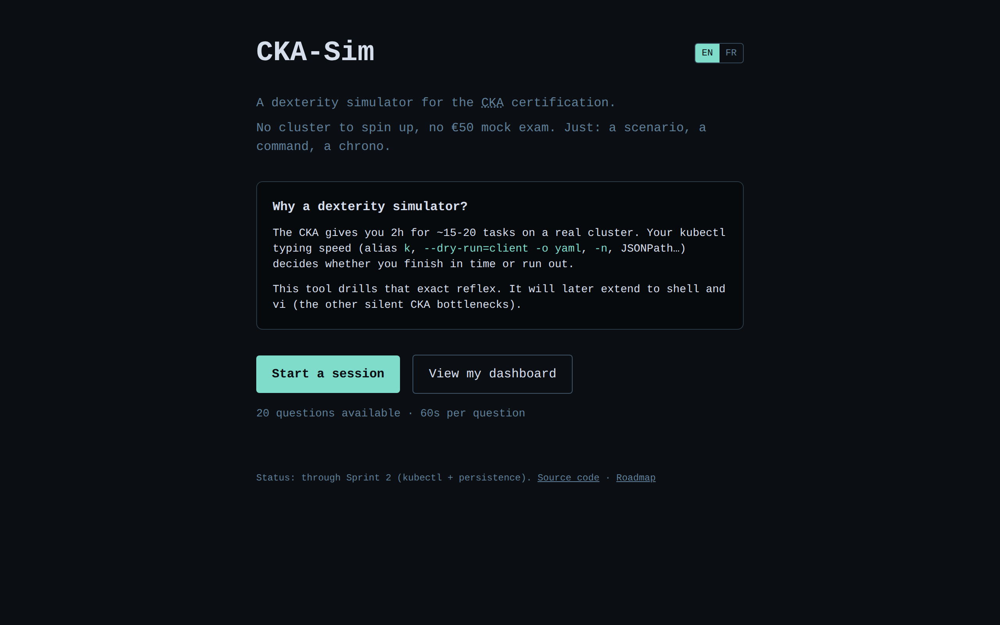
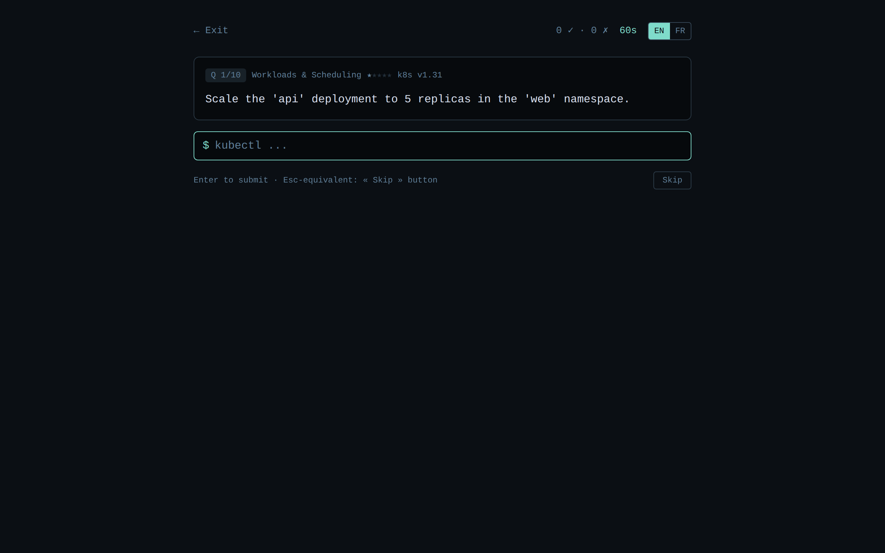
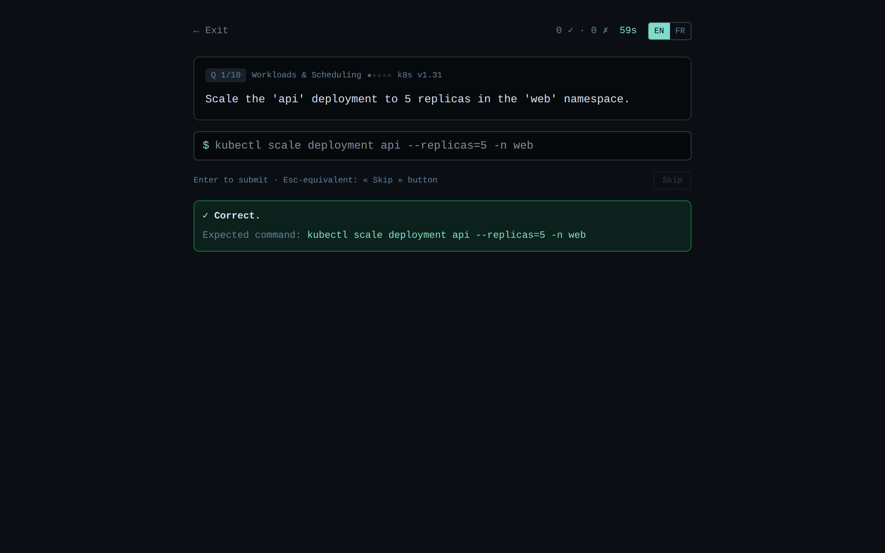
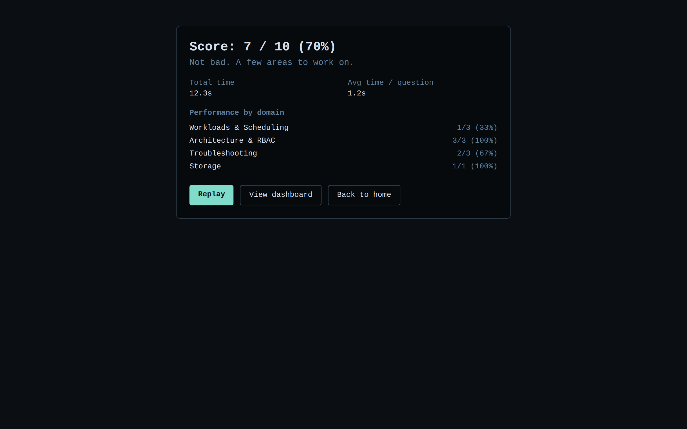
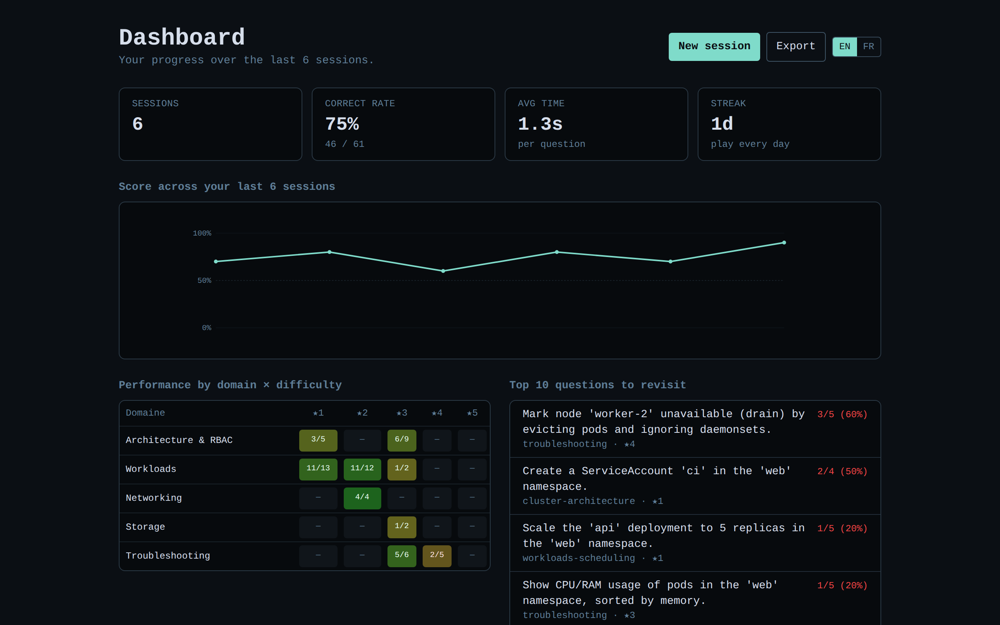
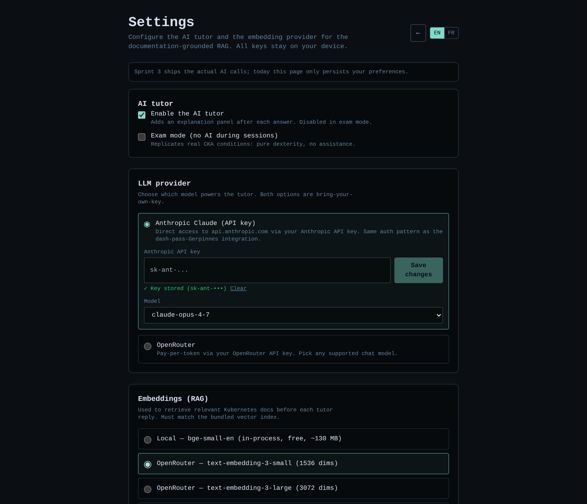

# CKA-Sim

> 🇬🇧 English version · [🇫🇷 Version française](./README.fr.md)

> A **kubectl/shell/vi dexterity simulator** to prepare for the
> [Certified Kubernetes Administrator (CKA)](https://www.cncf.io/certification/cka/)
> certification.

No cluster to spin up, no €50 mock exam. Just: a scenario, a command, a
chrono. The goal is to drill the **typing reflexes** that make the difference
between passing the CKA in time and running out of it.

---

## 📸 Preview

| Home | Session — question |
| :---: | :---: |
|  |  |
| **Feedback after a correct answer** | **End-of-session score** |
|  |  |

**Personal dashboard** — score curve, domain × difficulty heatmap, streak, top missed questions:



**Settings** — pick the AI tutor provider (Claude OAuth or OpenRouter), the embedding backend (local bge-small or OpenRouter), and toggle exam mode / RAG. Keys stay on your device:



---

## 🎯 Why this project

The CKA is 2 hours for ~15-20 tasks on a real cluster. Many failures are not
about lacking Kubernetes knowledge — they're about lacking speed:

- not using the `k` alias instead of `kubectl`
- forgetting `--dry-run=client -o yaml`
- typing `-n <ns>` on every command instead of fixing the context once
- improvising JSONPath under pressure
- clumsy vi editing eating up the minutes

Existing platforms (Killer.sh, KodeKloud) mostly drill **problem-solving**.
This tool targets **pure dexterity**, the motor reflex that comes from short,
chronometered repetition.

---

## ✨ What it does today (through Sprint 2)

- 20 kubectl questions covering all 5 official CKA domains
- 60-second chrono per question, end-of-session score
- **Deterministic** validation via regex (handles common variants:
  `-n`/`--namespace`, flag order, `k`/`kubectl` alias, etc.)
- Hint system with score penalty
- Per-domain breakdown to identify weak spots
- **Persistent history** with a personal dashboard: score curve, heatmap by
  domain × difficulty, day streak, top 10 most-missed questions
- **JSON export** of your full history (`/api/me/export`)
- 100% local-first: SQLite database on disk, anonymous local user via
  cookie, no auth, no remote service

> 🚧 Not yet: AI tutor, RAG, shell/vi, leaderboard.
> See the [ROADMAP](./docs/ROADMAP.md).

---

## 🚀 Quick start

Requirements: **Node.js ≥ 22**.

```bash
git clone https://github.com/ictdevops/cka-sim.git
cd cka-sim
npm install
npm run dev
```

Open <http://localhost:3000>. Press `Enter` to submit each command.

### Optional: enable the doc-grounded RAG

The AI tutor can ground its answers in the bundled Kubernetes
documentation snippets. To build the local vector index (one-time
setup, ~130 MB model download from Hugging Face on first run):

```bash
npm run kb:build
```

This produces `kb.db` at the repo root. Restart the server and the
tutor will now cite source URLs in its answers when RAG is enabled in
Settings. Without this step, the tutor still works but answers from its
own knowledge.

### Available scripts

| Script              | Description                              |
| ------------------- | ---------------------------------------- |
| `npm run dev`       | Dev server with HMR                      |
| `npm run build`     | Production build                         |
| `npm start`         | Start the production build               |
| `npm run typecheck` | Run TypeScript type checking             |
| `npm run lint`      | Run Next.js linter                       |
| `npm run kb:build`  | Build the RAG vector index (`kb.db`)     |

---

## 🧱 Architecture (overview)

```
src/
├── app/                    Next.js pages (App Router)
│   ├── page.tsx            Home
│   ├── about/page.tsx      Roadmap
│   └── session/page.tsx    Active session
├── components/             UI (Prompt, Timer, QuestionCard, ...)
├── lib/
│   ├── questions/          Types + question loading
│   ├── validators/         Deterministic validation (regex)
│   └── session/            Pure session engine (state machine)
└── data/
    └── questions/
        └── kubectl.json    Seed question bank
```

The **session engine** (`lib/session/engine.ts`) is intentionally *pure*:
`(state, event) => state` functions, no I/O, easy to test and to plug into a
store when needed.

The **validator** is an interface (`lib/validators/types.ts`) with a regex
implementation in the MVP (`RegexValidator`). A `SemanticValidator` (AST
parsing) or an `ExecutionValidator` (`kind` cluster) can be added later
without touching the rest.

📖 Details in [docs/ARCHITECTURE.md](./docs/ARCHITECTURE.md).

---

## 📝 Add or edit questions

Questions live in `src/data/questions/kubectl.json`. Each question is
self-describing:

```jsonc
{
  "id": "k-pods-001",
  "category": "kubectl",
  "domain": "workloads-scheduling",
  "scenario": "List all pods in the 'web' namespace.",
  "difficulty": 1,
  "challenge": {
    "type": "command",
    "expected": "kubectl get pods -n web",
    "acceptedPatterns": [
      "^(kubectl|k)\\s+get\\s+(pods?|po)\\s+(-n\\s+web|--namespace[= ]web)$"
    ],
    "explanation": "..."
  }
}
```

📖 Full schema and conventions:
[docs/QUESTION_SCHEMA.md](./docs/QUESTION_SCHEMA.md).

---

## 🗺 Roadmap (summary)

| Sprint | Goal                                                              | Status    |
| -----: | ----------------------------------------------------------------- | --------- |
|      1 | Pure kubectl dexterity (regex validation, chrono)                 | ✅ Done   |
|      2 | Persistence: SQLite runs/attempts + personal dashboard            | ✅ Done   |
|      3 | AI tutor (Claude OAuth + OpenRouter), post-answer feedback        | Upcoming  |
|      4 | Doc-grounded RAG (sqlite-vec + embeddings)                        | Upcoming  |
|      5 | Shell + vi extensions (codemirror-vim, keystroke-efficiency)      | Upcoming  |
|      6 | Custom web sources + admin ingestion UI                           | Upcoming  |

📖 Per-sprint details: [docs/ROADMAP.md](./docs/ROADMAP.md).

---

## 💾 Where your data lives

- Local SQLite database at `./data/app.db` (override with
  `CKA_SIM_DATA_DIR`).
- An anonymous user id is stored in the `cka-sim-uid` cookie. Clearing
  cookies = starting over.
- For Docker, mount `/app/data` as a volume to persist runs across
  container upgrades.
- One-shot backup: `curl -b 'cka-sim-uid=...' http://localhost:3000/api/me/export > backup.json`.

---

## 🔐 Privacy & licensing

- **No tracking, no telemetry**, no data sent to third parties in Sprint 1.
- Future AI calls will be **opt-in**, BYOK (OpenRouter API key) or via
  Claude OAuth — always client-side.
- Future documentation sources (kubernetes.io, etc.) are redistributable
  under their original license (kubernetes.io = CC BY 4.0). Every AI
  citation will link back to the source URL for traceability.

---

## 🤝 Contributing

PRs welcome, especially for:

- adding questions (please read
  [docs/QUESTION_SCHEMA.md](./docs/QUESTION_SCHEMA.md) first)
- reporting missing accepted patterns when valid commands are wrongly
  rejected (open an issue with the rejected command)

---

## 📜 License

To be defined (likely MIT or Apache 2.0).
